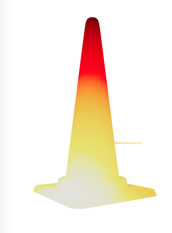

## Geodesic heat method
Checking out heat method used for geodesic distance computation in react three fiber.

Paper Link: [Heat Method for distance computation by Keenan Crane, Clarisse Weischedel, and Max Wardetzky](https://brickisland.net/DDGFall2017/wp-content/uploads/2017/12/HeatMethod.pdf)

Code is taken from Geometry Processing JS library.

### Output Image from the method
